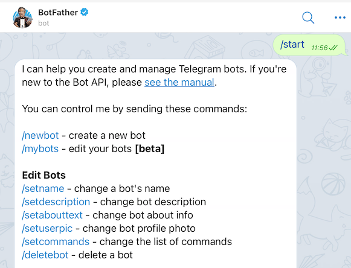
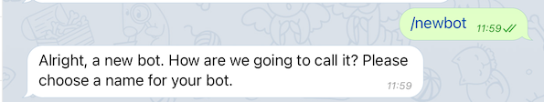
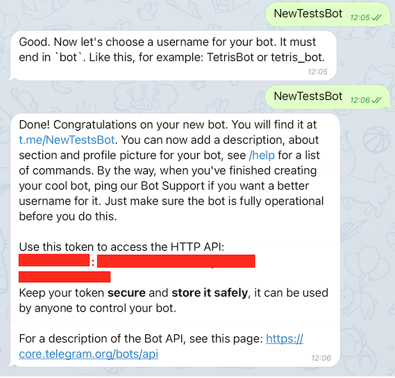

# TELEGRAM CHATBOT INTEGRATION

### TABLE OF CONTENTS
* [Introduction](#introduction)
* [Features](#features)
* [Prepare your Inbenta Instances](#prepare-your-inbenta-instances)
	* [Create translations object in ExtraInfo (optional)](#create-translations-object-in-extrainfo-optional)
	* [HyperChat integration (optional)](#hyperchat-integration-optional)
* [Building the Telegram Connector](#building-the-telegram-connector)
	* [Setup Chatbot Telegram Connector](#setup-chatbot-telegram-connector)
	* [HYPERCHAT (chat.php)](#hyperchat-chatphp)
	* [CONVERSATION (conversation.php)](#conversation-conversationphp)
	* [ENVIRONMENTS (environments.php)](#environments-environmentsphp)
	* [Deployment](#deployment)
* [Telegram Bot creation](#telegram-bot-creation)
* [Setting Webhook](#setting-webhook)


## **Introduction**
The purpose of this document is to provide the details of the integration of Inbenta’s Chatbot and Hyperchat solution with Telegram.

## **Features**
These are the supported answer types and features:
*   FAQ Intents with images, videos and Hyperlinks as external links.
*   Related Contents.
*   Sidebubble content (will show up in the main chat window).
*   Multiple options.
*   Polar Questions.
*   Dialogs.
*   Forms, Actions & Variables.
*   HyperChat Integration.
*   Ratings.

## **Prepare your Inbenta instances**

### **Create translations object in ExtraInfo (optional)**

You can manage the translation labels from Extra Info. Here are the steps to create the translations object:

1.  In your Backstage instance, go to Knowledge → Extra Info and click on 'Manage groups and types' → Add type. Name it '**translations**' and add a new property with type 'Multiple' named with your chatbot's language label (en, es, it...).

2.  Inside the language object, add all the labels that you want to override. Each label should be a 'text' type entry (you can find the labels list below).

3.  Save your translations object.

Now you can create the ExtraInfo object by clicking the **New entry** button, selecting the 'translations' type and naming it as 'translations'. Then, fill each label with your desired translation and remember to publish ExtraInfo by clicking the **Post** button.

Here you have the current labels with their English value:

*   **agent_joined** => 'Agent $agentName has joined the conversation.'
*   **api_timeout** => 'Please, reformulate your question.'
*   **ask_rating_comment** => 'Please tell us why'
*   **ask_to_escalate** => 'Do you want to start a chat with a human agent?'
*   **chat_closed** => 'Chat closed'
*   **creating_chat** => 'I will try to connect you with an agent. Please wait.'
*   **error_creating_chat** => 'There was an error joining the chat'
*   **escalation_rejected** => 'What else can I do for you?'
*   **no** => 'No'
*   **no_agents** => 'No agents available'
*   **queue_estimation_first** => ‘There is one person ahead of you.’
*   **queue_estimation** => ‘There are $queuePosition people ahead of you.’
*   **rate_content_intro** => 'Was this answer helpful?'
*   **thanks** => 'Thanks!'
*   **yes** => 'Yes'
*   **date_format** => "date format: mm/dd/YYYY"
*   **link** => "Link"


> **Information**
>
> Remember to publish your ExtraInfo changes by clicking the ‘Post’ button.
>
> Even if you have created the ExtraInfo translation, it is mandatory that the lang file exists in the “lang” folder. 

### **HyperChat integration (optional)**

If you use HyperChat you must subscribe your UI to the Hyperchat events. Open your _Messenger_ instance. Go to Messenger → Settings → HyperChat → Webhooks. 

Here, in the ‘Events’ column type “queues:update,invitations:new,invitations:accept,forever:alone,chats:close, messages:new,users:activity”. In the ‘Target’ column paste your UI’s URL, then click on the ‘+’ button on the right.

Make sure to select the accepted files for **file sharing** (allowed both end-users and agents). Go to Messenger → Settings → HyperChat → Conversation, and add one of the following (if is not in the list): jpeg, png, pdf, xls, xlsx, doc, docx, mp4, avi, mp3, aac, wav, wma, ogg, m4a, gif, oga.

> Voice format for Telegram is **OGG audio** (.oga), make sure is selected if you want to use it in the escalation.

## **Building the Telegram Connector**

### **Setup Chatbot Telegram Connector**

#### **Required Configuration**

In your UI directory, go to **conf**. Here, you have a readme file with some structure and usage explanations. If you only want to build a chatbot, fill the **key** and **secret** values inside the **conf/custom/api.php** file with your Inbenta Chatbot API credentials. If you want to modify other configuration parameters, copy the desired file(s) from **conf/default** into **conf/custom** and modify the values, the bot will detect the customization and it will load the customized version. These are the optional configuration files and the configuration fields description.

### **HYPERCHAT (chat.php)**

*   **chat** 
    *   **enabled**: Enable or disable HyperChat (“**true**” or “**false**”).
    *   **version**: HyperChat version. The default and latest one is 1.
    *   **appId**: The ID of the HyperChat app. This defines the instance in which the chat opens. You can find it in your instance → Messenger → Settings → Chat.
    *   **secret**: Your HyperChat instance application secret. You can find it in your instance → Messenger → Settings → Chat.
    *   **roomId**: The room where the chat opens. This is mapped directly to a Backstage queue ID. Numeric value, not a string. You can find your rooms list it in your instance → Messenger → Settings → Queues.
    *   **lang**: Language code (in ISO 639-1 format) for the current chat. This is used when the engine checks if there are agents available for this language to assign the chat to one of them.
    *   **source**: Source id from the sources in your instance. Numeric value, not a string. The default value is **3 - Chat**. You can find your sources list it in your instance → Messenger → Settings → Sources.
    *   **regionServer**: The geographical region where the HyperChat app lives.
    *   **server**: The Hyperchat server URL assigned to your instance. Ask your Inbenta contact for this configuration parameter.
    *   **server_port**: The port where to communicate with the Hyperchat server. It’s defined in your instance → Messenger → Settings → Chat -->Port
    *   **queue**:
        *   **active**: Enable or disable the queue system (“**true**” or “**false**”). It **MUST** be enabled in your instance too (Messenger → Settings → Chat → Queue mode).
*   **triesBeforeEscalation**: Number of no-result answers in a row after the bot should escalate to an agent (if available). Numeric value, not a string. Zero means it’s disabled.
*   **negativeRatingsBeforeEscalation**: Number of negative content ratings in a row after the bot should escalate to an agent (if available). Numeric value, not a string. Zero means it’s disabled.


### **CONVERSATION (conversation.php)**

*   **default:** Contains the API conversation configuration. The values are described below:
    *   **answers:**
        *   **sideBubbleAttributes:** Dynamic settings to show side-bubble content. Because there is no side-bubble in Telegram the content is shown after the main answer.
        *   **answerAttributes:** Dynamic settings to show as the bot answer. The default is [ "ANSWER_TEXT" ]. Setting multiple dynamic settings generates a bot answer with concatenated values with a newline character (\n).
        *   **maxOptions:** Maximum number of options returned in a multiple-choice answer.
    *   **forms**
        *   **allowUserToAbandonForm:** Whether or not a user is allowed to abandon the form after a number of consecutive failed answers. The default value is **true**.
        *   **errorRetries:** The number of times a user can fail a form field before being asked if he wants to leave the form. The default value is 3.
    *   **lang:** Language of the bot, represented by its ISO 639-1 code. Accepted values: ca, de, en, es, fr, it, ja, ko, nl, pt, zh, ru, ar, hu, eu, ro, gl, da, sv, no, tr, cs, fi, pl, el, th, id, uk
*   **user_type**: Profile identifier from the Backstage knowledge base. Minimum:0\. Default:0\. You can find your profile list in your Chatbot Instance → Settings → User Types.
*   **source**: Source identifier (default value **telegram**) used to filter the logs in the dashboards.
*   **content_ratings**
    *   **enabled**: Enable or disable the rating feature (“**true**” or “**false**”).
    *   **ratings**: Array of options to display in order to rate the content. Every option has the following parameters:
        *   **id:** Id of your content rating. You can find your content ratings in your Chatbot instance → Settings → Ratings. Remember that your rating type should be "**content**".
        *   **label:** Key of the label translation to display within the rating option button. The available labels can be configured from **/lang/**. Also can be modified from Backstage as described in section **Create translations object in ExtraInfo (optional)**
        *   **comment:** If **true**, asks for a comment for the rating. It's useful when a user rates a content negatively in order to ask why the negative rating.
        *   **isNegative:** If **true**, the bot will increment the negative-comments counter in order to escalate with an agent (if HyperChat **negativeRatingsBeforeEscalation** is configured).

### **ENVIRONMENTS (environments.php)**

This file allows configuring a rule to detect the current environment for the connector, this process is made through the URL where the application is running. It can check the current **http_host** or the **script_name** in order to detect the environment.

*   **development:** 

    *   **type**: Detection type: check the **http_host** (e.g. [_www.example.com_](http://www.example.com/)) or the **script_name** (e.g. _/path/to/the/connector/server.php_).

    *   **regex**: Regex to match with the detection type (e.g. “_/^dev.mydomain.com$/m_“ will set the “development” environment when the detection type is [_dev.example.com_](http://dev.example.com/)).

### **Deployment**

The Telegram template must be served by a public web server in order to allow Telegram to send the events to it. The environment where the template has been developed and tested has the following specifications

*   Apache 2.4
*   PHP 7.3
*   PHP Curl extension
*   Non-CPU-bound
*   The latest version of [**Composer**](https://getcomposer.org/) (Dependency Manager for PHP) to install all dependencies that Inbenta requires for the integration.
*   If the client has a **distributed infrastructure**, this means that multiple servers can manage the user session, they must adapt their SessionHandler so that the entire session is shared among all its servers.

# Telegram Bot creation

From an existing Telegram account (this will be the admin account of the bot), go to [BotFather](https://t.me/botfather) (searching inside Telegram for “BotFather” works as well).



Type the command **/newbot** in order to create a new Bot. The BotFather will ask you for a name and username, then generate an authorization token for your new bot.



After the name and username of the bot are set, a **Token** is given, and it’s needed to make the requests from Chatbot connector to Telegram.



You can see more information at: [https://core.telegram.org/bots#6-botfather](https://core.telegram.org/bots#6-botfather)

# Setting Webhook

In order to make the Chatbot responses get to your Bot (and vice versa), you need to register a webhook.

Inside **conf/custom/telegram.php** file, add the Telegram Token (from previous step) and the URL where the Telegram Chatbot Connector is installed:

```php
return [
    'token' => '',
    'url' => ''
];
```

After the values are filled properly, go to any web browser and type (replace with your values):

_<**url_connector**>/?subscribe=1&token=<**telegramToken**>_

This process will compare the given token with the token inside the **telegram.php** file, if both match then the register of the webhook with your bot will happen.

Additionally, you can configure more options for your webhook using the Telegram API, check: [https://core.telegram.org/bots/api#setwebhook](https://core.telegram.org/bots/api#setwebhook)